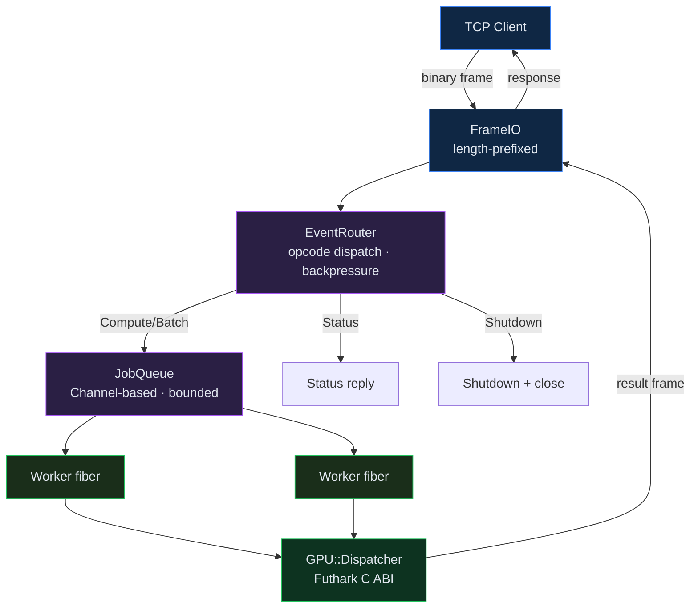
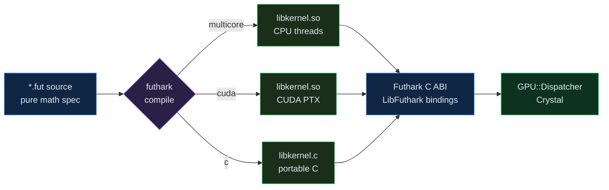
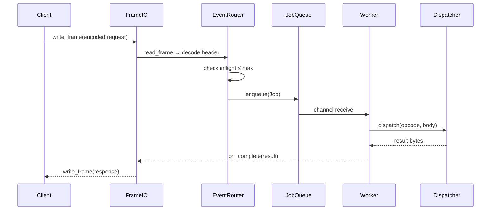

```
███████╗██╗   ██╗████████╗██╗  ██╗ █████╗ ██████╗ ██╗  ██╗
██╔════╝██║   ██║╚══██╔══╝██║  ██║██╔══██╗██╔══██╗██║ ██╔╝
█████╗  ██║   ██║   ██║   ███████║███████║██████╔╝█████╔╝ 
██╔══╝  ██║   ██║   ██║   ██╔══██║██╔══██║██╔══██╗██╔═██╗ 
██║     ╚██████╔╝   ██║   ██║  ██║██║  ██║██║  ██║██║  ██╗
╚═╝      ╚═════╝    ╚═╝   ╚═╝  ╚═╝╚═╝  ╚═╝╚═╝  ╚═╝╚═╝  ╚═╝

         ██████╗██████╗ ██╗   ██╗███████╗████████╗ █████╗ ██╗     
        ██╔════╝██╔══██╗╚██╗ ██╔╝██╔════╝╚══██╔══╝██╔══██╗██║     
        ██║     ██████╔╝ ╚████╔╝ ███████╗   ██║   ███████║██║     
        ██║     ██╔══██╗  ╚██╔╝  ╚════██║   ██║   ██╔══██║██║     
        ╚██████╗██║  ██║   ██║   ███████║   ██║   ██║  ██║███████╗
         ╚═════╝╚═╝  ╚═╝   ╚═╝   ╚══════╝   ╚═╝   ╚═╝  ╚═╝╚══════╝

         Python-free GPU compute stack — Futhark kernels + Crystal runtime
```

# futhark-crystal-stack

Python-free, high-performance declarative GPU mathematics engine with an asynchronous Crystal systems shell.

**Futhark** owns all mathematical specification and kernel generation (CUDA, multicore, or pure C). **Crystal** owns networking, event routing, scheduling, memory ownership, and process control.

---

## Repository layout

```
futhark-crystal-stack/
├── futhark/
│   ├── math/          vector.fut · numeric.fut · helpers.fut
│   ├── kernels/       matmul · softmax · conv2d · vector_ops
│   │                  reduce_scan · stencil · fft_placeholder
│   ├── tensor/        normalize.fut (layer norm)
│   ├── matrix/        lu.fut
│   └── Makefile
├── crystal/
│   ├── src/
│   │   ├── protocol/  opcodes · checksum (CRC-32C) · frame
│   │   ├── net/       framing (length-prefixed FrameIO)
│   │   ├── router/    EventRouter + backpressure
│   │   ├── scheduler/ Channel-based JobQueue + worker pool
│   │   ├── gpu/       futhark_bindings (LibFuthark C ABI) · dispatcher
│   │   └── runtime/   Server (TCPServer + fiber-per-connection)
│   └── shard.yml      (zero external deps)
├── examples/          client.cr
├── tests/             protocol_roundtrip.cr
├── benchmarks/        README.md
├── docs/              contracts.md
└── build.sh
```

---

## System architecture



---

## Futhark kernel pipeline



---

## Request lifecycle



---

## Build

```bash
# Multicore (no GPU required)
cd futhark && make multicore

# Crystal host
cd crystal && crystal build src/main.cr -o bin/fc-stack --release

# Or run the build script
./build.sh
```

CUDA target when NVIDIA toolchain present:

```bash
cd futhark && make cuda
```

---

## Binary protocol (v1)

Little-endian frames over TCP. No JSON on the hot path.

| Field | Size | Description |
|-------|------|-------------|
| MAGIC | 4 | `0x44535948` |
| VERSION | 2 | `1` |
| REQUEST_ID | 8 | client-chosen |
| OPCODE | 1 | `Compute=1 Batch=2 Memory=3 Device=4 Status=5 Shutdown=6` |
| FLAGS | 1 | `ZeroCopy · Pinned · BatchAsync` |
| INPUT_COUNT | 2 | number of input buffers |
| BODY_LEN | 4 | payload length |
| BODY | variable | packed tensor data |
| CHECKSUM | 4 | CRC-32C of BODY |

---

## Mathematical contracts

Every Futhark entry point is a pure function. Contracts are in `docs/contracts.md`.

| Kernel | Contract |
|--------|----------|
| `matmul_f32` | `C[i,j] = Σ_k A[i,k] * B[k,j]` — shape-safe, finite |
| `softmax_f32` | numerically stable; output sums to 1 |
| `conv2d_valid_f32` | valid padding, linear, no bias |
| `layer_norm_f32` | mean=0 std=1 along last axis |
| `lu_f32` | LU without pivoting (well-conditioned inputs) |
| `fft_real_placeholder` | identity — replace with real FFT |

---

## Design principles

- Futhark specifies *what* to compute; CUDA/multicore specifies *where*
- Crystal specifies *how* to route, schedule, and supervise
- Binary protocol only on hot path — no JSON serialization overhead
- Explicit memory ownership: host → pinned → device tracked in `MemoryTracker`
- Fail-closed: every error path named; no silent fallbacks
- Zero Python anywhere in the stack

---

## Running the tests

```bash
crystal run tests/protocol_roundtrip.cr
```

---

## License

Sovereign Leviathan Covenant. See `license`.
